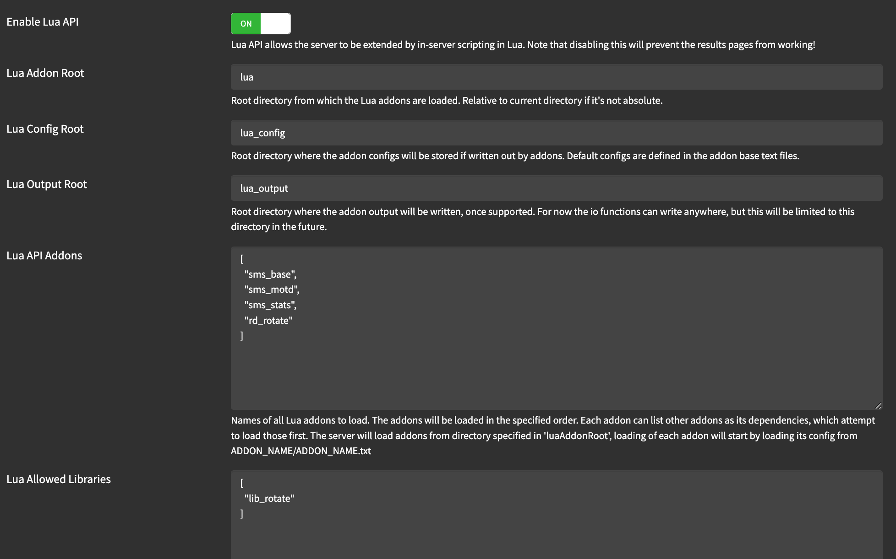

# rd_rotate

Simplified lua rotation script for AMS2

Based on sms_rotate.lua, but modified to play nice with the emperor server manager by honouring most of the event settings in server.cfg

# installation

1. copy `lua/rd_rotate` to the `lua` directory on the dedicated server install
2. ensure `Enable Lua API` is enabled in the server settings
3. add `rd_rotate` to the `Lua API Addons` in the server settings

e.g.

4. start the dedicated server and edit `lua_config/rd_rotate_config.json` as required

# 
